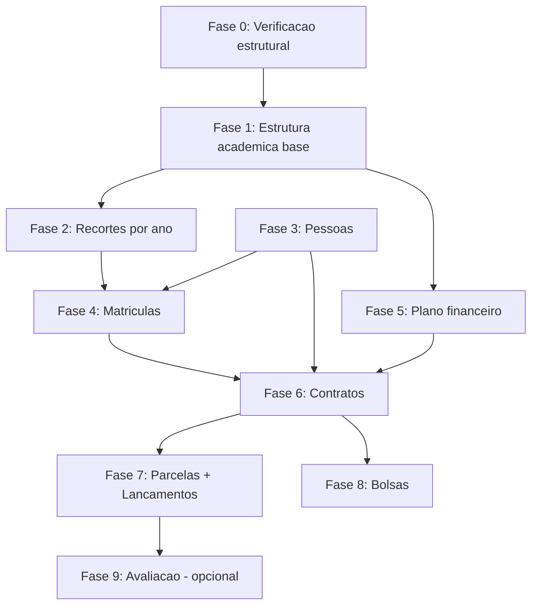

# 03 - Ordem de Importacao Gennera -> TOTVS RM

> Sequencia OBRIGATORIA respeitando dependencias FK em ambos os sistemas.
> Cada fase entrega entidades especificas e tem validacoes pos antes de
> liberar a fase seguinte.

---

## Visao geral - 9 fases



---

## Fase 0 - Verificacao estrutural

**Objetivo:** confirmar que o RM esta acessivel, contexto correto, sem mexer em nada.

**Acoes:**
1. `AutenticaAcesso` - retorna 1?
2. `ReadView` em DataServers funcionais (EduContratoData, EduParcelaData, EduPlanoPgtoData) - retorna dados?
3. Confirmar IDPERLETs ja cadastrados (mapeamento ano -> IDPERLET)
4. Confirmar SCURSO, SHABILITACAO existem (via UI se filtro de perfil bloquear ReadView)

**Validacao pos:** zero escritas, tudo confirmado.

**Bloqueia avancar se:** auth falhou, contexto invalido, IDPERLET de algum ano necessario nao existe.

---

## Fase 1 - Estrutura academica base

**Objetivo:** garantir que todos os catalogos mestres estao no RM.

**Entidades (em ordem):**

1. `SCURSO` (4 cursos EDF: EI, EF1, EF2, EM) — provavelmente ja existe
2. `SHABILITACAO` (16 habilitacoes) — provavelmente ja existe
3. `SGRADE` (anos 2021-2026 como grades) — provavelmente ja existe
4. `SDISCIPLINA` (catalogo de disciplinas) — provavelmente ja existe
5. `SPERIODO` (P1, P2, P3, REC) — provavelmente ja existe
6. `SPLETIVO` (1 por ano letivo) — **2022 precisa ser criado**
7. `SETAPAS` (etapas avaliativas por habilitacao) — opcional 1a fase
8. `SINSTITUICAO` (registro EDF) — fixo

**Fonte:** views `export.scurso`, `export.shabilitacao`, `export.sgrade`, `export.spletivo`, `export.setapas`, `export.sdisciplina`, `export.speriodo`.

**Operacao:** `SaveRecord(EduCursoData)`, `SaveRecord(EduHabilitacaoData)`, etc.

**Validacao pos:**
```sql
-- Conferir que tudo do gennera_stg tem destino correspondente
SELECT 'SCURSO', COUNT(*) FROM export.scurso
UNION ALL
SELECT 'SHABILITACAO', COUNT(*) FROM export.shabilitacao;
```

```javascript
// Confirmar via ReadView
const r = await rv('EduPLetivoData', `SPLETIVO.CODPERLET='2022'`);
// Deve retornar 1 registro com IDPERLET gerado
```

**Bloqueia Fase 2 se:** ainda nao tem IDPERLET para algum ano que vai ser migrado.

---

## Fase 2 - Recortes por ano (estruturas anuais)

**Objetivo:** criar combinacoes especificas por ano.

**Entidades:**

1. `SHABILITACAOFILIAL` - (curso+habilitacao+filial+IDPERLET) - **pre-requisito de SMATRICULA e SCONTRATO**
2. `SDISCGRADE` - disciplinas da grade naquele ano
3. `STURMA` - turmas do ano
4. `STURMADISC` - disciplinas das turmas
5. `SMODETAPAPLETIVO` - etapas naquele periodo letivo

**Fonte:** `export.shabilitacaofilial`, `export.shabilitacaofilialpl`, `export.sturma`, `export.sturmadisc`.

**Validacao pos:**
```javascript
// Cada combinacao curso+hab+ano+filial tem IDHABILITACAOFILIAL?
// Diego 2022: curso=EF2, hab=8 (8o ano), filial=UN1, ano=2022 -> deve ter IDHABFIL
```

**Bloqueia Fase 4 se:** alguma SHABILITACAOFILIAL do aluno alvo nao existe.

---

## Fase 3 - Pessoas

**Objetivo:** cadastrar pessoas no RM antes de criar SCONTRATO.

**Entidades:**

1. `PPESSOA` (Diego, Joselia, Vanderlei, etc.) - cadastro pessoal
2. `FCFO` (Joselia como cliente financeiro) - se nao existir
3. `SALUNO` (Diego como aluno - RA, datas) - se nao existir

**Fonte:** `export.ppessoa` (Isac em refatoracao), `export.fcfo` / `export_v2.fcfo`.

**Atencao:** confirmar via UI quem ja existe (filtro de perfil bloqueia ReadView de EduAlunoData). Diego ja existe como SALUNO confirmado pelo print da UI.

**Validacao pos:**
- ReadView SCONTRATO de uma pessoa criada nao deve dar fault de FK
- Buscar a pessoa via outros DataServers (EduResponsavelData, EduContratoData) se possivel

**Bloqueia Fase 4 e 6 se:** RA ou CODCFO necessario nao existe.

---

## Fase 4 - Vinculos academicos

**Objetivo:** ligar aluno ao plano academico.

**Entidades:**

1. `SHABILITACAOALUNO` (Diego cursa EF2 8 ano em 2022)
2. `SMATRICULA` (Diego matriculado em 2022)
3. `SMATRICPL` (Diego em 2022 vinculado ao plano financeiro X) - **ponte critica acad <-> financeiro**

**Fonte:** `export.shabilitacaoaluno`, `export.smatricula`, `export.smatricpl`.

**Dependencias:** Fase 1 (SHABILITACAO, SCURSO) + Fase 2 (SHABILITACAOFILIAL, STURMA) + Fase 3 (SALUNO).

**Validacao pos:**
```javascript
// SMATRICULA + SMATRICPL existem para o aluno?
const r = await rv('EduMatricPLData', `SMATRICPL.RA='20142166'`);
// Deve retornar 1 ou mais
```

---

## Fase 5 - Plano financeiro

**Objetivo:** garantir que o plano de pagamento existe e esta vinculado a habilitacao.

**Entidades:**

1. `SSERVICO` (MENS, ALIM, MAT, 1aMENS) - **provavelmente ja existe**
2. `SPLANOPGTO` (plano "8 ano EFII UN1 2022" -> codigo "221001") - precisa criar se nao existir
3. `SPARCPLANO` (parcelas padrao do plano) - opcional, consultor TOTVS disse pular
4. `SHABMODELOPGTO` (plano X liga a SHABILITACAOFILIAL Y) - **pre-requisito SCONTRATO**

**Fonte:** `export_v2.sservico`, `export_v2.splanopgto`, `export_v2.sparcplano`, `export_v2.shabmodelopgto`.

**Dependencias:** Fase 1 (SPLETIVO) + Fase 2 (SHABILITACAOFILIAL).

**Validacao pos:** Tem SHABMODELOPGTO ligando o plano 221001 ao IDHABILITACAOFILIAL do Diego.

---

## Fase 6 - Contrato

**Objetivo:** criar o contrato consolidado do aluno no RM.

**Entidades:** `SCONTRATO` (1 por aluno+ano).

**Decisao confirmada:** 1 SCONTRATO consolidado, NAO replicar os 4 do Gennera.

**Fonte:** `export_v2.scontrato`.

**Campos minimos obrigatorios:**
```xml
<SCONTRATO>
  <CODCOLIGADA>1</CODCOLIGADA>
  <CODCONTRATO>{auto ou sequencial}</CODCONTRATO>
  <RA>20142166</RA>
  <IDPERLET>{Fase 1}</IDPERLET>
  <IDHABILITACAOFILIAL>{Fase 2}</IDHABILITACAOFILIAL>
  <CODFILIAL>1</CODFILIAL>
  <CODTIPOCURSO>1</CODTIPOCURSO>
  <CODCFO>1645</CODCFO>  <!-- Fase 3 -->
  <CODPLANOPGTO>221001</CODPLANOPGTO>  <!-- Fase 5 -->
  <DTCONTRATO>2021-10-21T00:00:00</DTCONTRATO>
  <DTASSINATURA>2021-10-21T00:00:00</DTASSINATURA>
  <DIAVENCIMENTO>5</DIAVENCIMENTO>
  <TIPOCONTRATO>S</TIPOCONTRATO>
  <ASSINADO>S</ASSINADO>
  <STATUS>N</STATUS>
</SCONTRATO>
```

**Dependencias:** Fases 1, 2, 3, 5 completas.

**Validacao pos:**
```javascript
const r = await rv('EduContratoData', `SCONTRATO.RA='20142166'`);
// Conta = 1 (Diego 2022). NOMEALUNO = Diego Silva Pereira de Sousa.
```

---

## Fase 7 - Parcelas e lancamentos

**Objetivo:** criar as parcelas e gerar lancamentos financeiros.

**Entidades:**

1. `SPARCELA` (37 para Diego 2022: 1 REMATRIC + 12 MENS + 12 ALIM + 12 MAT)
2. `FLAN` (preferencialmente gerado AUTO pelo RM)
3. `SLAN` (gerado AUTO)

**Fonte:** `export_v2.sparcela` (BUG conhecido: perde ALIM/MAT - investigar antes!).

**Atencao:** o RM normalmente gera FLAN e SLAN automaticamente apos SaveRecord de SPARCELA. Confirmar empiricamente. Se nao gerar, usar `wsFin.SaveLancamento` para criar FLAN manualmente.

**Validacao pos:**
```javascript
const r = await rv('EduParcelaData', `SPARCELA.RA='20142166'`);
// Conta = 37. Soma VALOR = R$ 70.367,00 (bate com Gennera)
```

---

## Fase 8 - Bolsas

**Objetivo:** registrar bolsas/descontos.

**Entidades:**

1. `SBOLSA` (catalogo) - provavelmente ja existe
2. `SBOLSAPLETIVO` (bolsa x periodo letivo) - se a bolsa do aluno e nova naquele ano
3. `SBOLSAALUNO` (bolsa individual do aluno)

**Fonte:** `export_v2.sbolsaaluno`.

**Caso Diego 2022:** sem bolsa, pular.

**Caso geral:** verificar `gennera_stg.servicos.DescBolsas` para detectar descontos individuais.

---

## Fase 9 - Avaliacao (opcional, escopo 2)

**Objetivo:** migrar historico de notas e frequencia.

**Entidades:** `SPROVAS`, `SNOTAS`, `SNOTAETAPA`, `SFREQUENCIA`, `SHISTALUNOCOL`, `SHISTDISCCOL`.

**Decisao:** **fora do primeiro piloto**. Aluno fica matriculado, mas sem historico avaliativo migrado. Migracao se faz num segundo round se cliente exigir.

---

## Tabela-resumo de dependencias

| Fase | Depende de | Entrega |
|------|-----------|---------|
| 0 | - | Verificacao |
| 1 | 0 | Cursos, Habilitacoes, Grades, Disciplinas, Periodos, Periodos Letivos, Etapas |
| 2 | 1 | SHABILITACAOFILIAL, STURMA, STURMADISC |
| 3 | 0 | PPESSOA, FCFO, SALUNO |
| 4 | 1, 2, 3 | SHABILITACAOALUNO, SMATRICULA, SMATRICPL |
| 5 | 1, 2 | SSERVICO, SPLANOPGTO, SHABMODELOPGTO |
| 6 | 1, 2, 3, 5 | SCONTRATO |
| 7 | 6 | SPARCELA, FLAN, SLAN |
| 8 | 6, 7 | SBOLSA, SBOLSAPLETIVO, SBOLSAALUNO |
| 9 | 4 | SPROVAS, SNOTAS, SFREQUENCIA (opcional) |

---

## Cronograma estimado (1 aluno - piloto Diego)

| Fase | Tempo estimado | Chamadas SOAP |
|------|----------------|---------------|
| 0 | 5 min | 10 ReadViews |
| 1 | 10 min | ~20 SaveRecords (so se faltar) |
| 2 | 5 min | ~5 SaveRecords (SHABILITACAOFILIAL principalmente) |
| 3 | 5 min | 3 SaveRecords (Joselia + Vanderlei + Diego se faltar) |
| 4 | 5 min | 3 SaveRecords (SHABILITACAOALUNO + SMATRICULA + SMATRICPL) |
| 5 | 10 min | 6 SaveRecords (SSERVICOs + SPLANOPGTO + SHABMODELOPGTO) |
| 6 | 2 min | 1 SaveRecord SCONTRATO |
| 7 | 15 min | 37 SaveRecords SPARCELA |
| 8 | 2 min | 0 (Diego sem bolsa) |
| **Total** | **~1h** | **~85 SaveRecords + ~20 ReadViews** |

Para 14.000 alunos: paralelizando 5 conexoes simultaneas, serial fase a fase, **~6 dias** de execucao continua. Se serializar tudo, ~30 dias.

---

## Para escalar para massa (apos piloto OK)

1. Reaproveitar Fase 0-2 (estrutura ja criada para Diego serve para outros)
2. Pessoas: batch unico para todas as 9k pessoas (PPESSOA + FCFO + SALUNO)
3. Fase 4-7: paralelizar por turma (alunos de uma turma juntos)
4. Fase 8 (bolsas): so para alunos com `servicos.DescBolsas > 0`

---

## Referencias

- `knowledge/fluxo/01_mapeamento_entidades.md` - de para detalhado
- `knowledge/fluxo/02_regras_transformacao.md` - regras de conversao
- `knowledge/fluxo/05_caso_piloto_diego.md` - exemplo completo end-to-end
- `knowledge/totvs/02_api_soap_tbc.md` - como chamar SaveRecord
